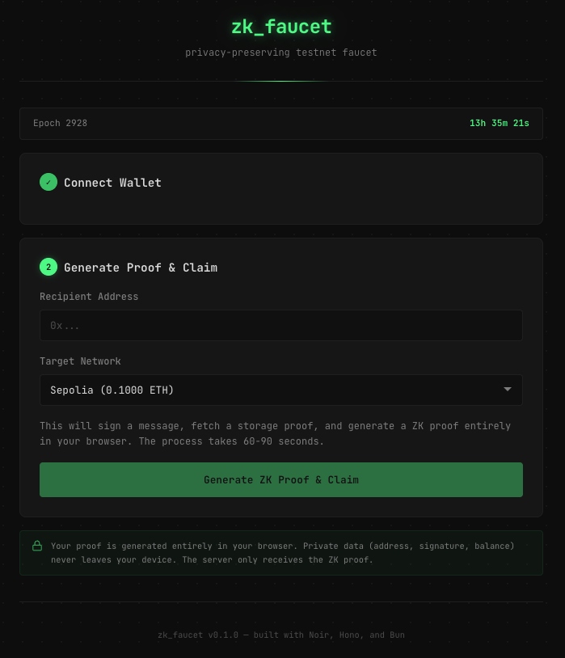

# zk_faucet



A privacy-preserving testnet faucet that uses zero-knowledge storage proofs to verify ETH balances on a configurable origin chain without revealing user identity.

Users prove they hold sufficient ETH on the origin chain (configured via `ORIGIN_CHAINID`) by generating a ZK proof over their account's Merkle-Patricia Trie (MPT) inclusion in the state trie. The faucet server verifies the proof and sends testnet ETH to a completely separate recipient address. At no point does the server learn which address generated the proof.

## Table of Contents

- [How It Works](#how-it-works)
- [Architecture](#architecture)
- [ZK Circuit](#zk-circuit)
- [Security Model](#security-model)
- [Getting Started](#getting-started)
- [Running the Project](#running-the-project)
- [Deployment](#deployment)
- [Testing](#testing)
- [API Reference](#api-reference)
- [Circuit Details](#circuit-details)
- [Design Decisions](#design-decisions)
- [Known Limitations](#known-limitations)
- [Contributing](#contributing)
- [Stack](#stack)
- [License](#license)

## How It Works

1. The user connects their wallet (switched to the origin chain) and signs an epoch-specific domain message.
2. A ZK proof is generated client-side proving:
   - The user controls an Ethereum private key (via ECDSA signature verification).
   - The corresponding address holds sufficient ETH (via MPT storage proof against a recent state root).
   - A deterministic nullifier derived from the public key and current epoch.
3. The proof is submitted to the faucet server along with the desired testnet recipient address.
4. The server verifies the proof cryptographically (UltraHonk via Barretenberg WASM), checks the nullifier has not been spent in this epoch, validates the state root is recent (within 256 blocks), and dispatches testnet ETH.
5. The nullifier prevents the same key from claiming more than once per epoch, but the server never learns which mainnet address was used.

**Privacy guarantees:** The address, public key, signature, account balance, and MPT proof data are all private circuit inputs. Only the nullifier, epoch, minimum balance threshold, and state root are public. The nullifier is a Poseidon2 hash of the public key coordinates and epoch -- it cannot be reversed to recover the address.

## Architecture

```
                     +-------------------+
                     |     Frontend      |
                     |    (React 19)     |
                     |  Reown AppKit     |
                     |  bb.js proving    |
                     +--------+----------+
                              |
                     signs domain message,
                     submits proof + recipient
                              |
                              v
+----------+        +------------------+        +------------------+
|  Caddy   | -----> |   Hono Server    | -----> | Testnet RPC      |
|  (TLS)   |        |                  |        | (Sepolia, etc.)  |
+----------+        |  - Proof verify  |        +------------------+
                     |  - Nullifier DB  |
                     |  - State root    |
                     |    oracle        |
                     +--------+---------+
                              |
                     validates state root
                     against recent L1 blocks
                              |
                              v
                     +------------------+
                     |  Ethereum L1 RPC |
                     |  (state roots)   |
                     +------------------+


ZK Proof Generation (client-side):

  Private Key --> Sign epoch message --> ECDSA sig (r, s)
       |
       +--> Derive pubkey (x, y) --> keccak256 --> address
       |
       +--> eth_getProof(address) --> MPT account proof
       |
       +--> Poseidon2(pubkey_x, pubkey_y, epoch) --> nullifier

  All above fed into Noir circuit --> UltraHonk proof (~85s)

  Public outputs: [state_root (32 bytes), epoch, min_balance, nullifier]
```

### Package Structure

| Package | Description |
|---------|-------------|
| `packages/circuits` | Noir ZK circuit (`eth_balance`) with vendored `noir-lang/eth-proofs` for MPT verification |
| `packages/server` | Hono API server with real Barretenberg proof verification (Bun runtime) |
| `packages/frontend` | React 19 SPA (Vite + Reown AppKit + wagmi v3 for wallet, bb.js for in-browser proving) |
| `packages/e2e` | End-to-end integration tests with in-process test server |

### Claim Flow (Server-Side)

1. Parse and validate the request body with valibot schemas.
2. Look up the proof module by `moduleId` in the `ModuleRegistry`.
3. Validate public inputs: epoch matches current epoch, minimum balance meets threshold, state root is recent (within 256 L1 blocks).
4. Decode the hex proof and verify it with the Barretenberg UltraHonk WASM backend.
5. Attempt to record the nullifier via atomic `INSERT OR IGNORE` in SQLite (race-safe).
6. Dispatch testnet ETH via the `FundDispatcher` (viem wallet client).
7. If dispatch fails, the nullifier is automatically rolled back (`unspend()`) so the user can retry.
8. Record the claim in the persistent `ClaimStore` (SQLite) and return the transaction hash.

## ZK Circuit

The core circuit is at `packages/circuits/bin/eth_balance/src/main.nr`. It enforces six constraints:

### Constraint 1: In-Circuit Message Hash Derivation

The circuit computes the EIP-191 message hash from the public `epoch` input, preventing signature replay attacks. The domain message format is fixed-length (50 bytes):

```
Domain message:  "zk_faucet_v1:eth-balance:nullifier_seed:" + epoch_padded_10_digits
EIP-191 wrapped: "\x19Ethereum Signed Message:\n50" + domain_message  (78 bytes total)
Hash:            keccak256(eip191_message)
```

The epoch is zero-padded to 10 digits (e.g., epoch 2928 becomes `"0000002928"`) so the message is always exactly 50 bytes, enabling fixed-length in-circuit computation.

### Constraint 2: ECDSA Signature Verification

Verifies the secp256k1 signature `(sig_r, sig_s)` against the provided public key `(pubkey_x, pubkey_y)` and the in-circuit computed message hash.

### Constraint 3: Address Derivation

Asserts that `keccak256(pubkey_x || pubkey_y)[12..32] == address`, ensuring the public key corresponds to the claimed Ethereum address.

### Constraint 4: MPT Account Proof Verification

Verifies a Merkle-Patricia Trie inclusion proof against the public `state_root`, walking branch and extension nodes to the leaf, then extracts the account's RLP-encoded balance. This uses the vendored `noir-lang/eth-proofs` library.

### Constraint 5: Balance Check

Asserts `verified_balance >= min_balance` where `min_balance` is a public input (configured via `MIN_BALANCE_WEI`).

### Constraint 6: Nullifier Derivation

Computes `nullifier = Poseidon2(pubkey_x_field, pubkey_y_field, epoch)` and asserts it matches the public nullifier input. The nullifier is derived from the **public key** (not the signature) to ensure determinism regardless of ECDSA nonce randomness.

### Circuit Inputs

| Input | Visibility | Type | Description |
|-------|-----------|------|-------------|
| `sig_r`, `sig_s` | Private | `[u8; 32]` each | ECDSA signature components |
| `pubkey_x`, `pubkey_y` | Private | `[u8; 32]` each | secp256k1 public key coordinates |
| `address` | Private | `[u8; 20]` | Ethereum address |
| `proof_key` | Private | `[u8; 66]` | Left-padded keccak256(address) |
| `proof_value` | Private | `[u8; 110]` | Left-padded RLP-encoded account state |
| `proof_nodes` | Private | `[[u8; 532]; 10]` | MPT internal nodes (padded) |
| `proof_leaf` | Private | `[u8; 148]` | MPT leaf node (padded) |
| `proof_depth` | Private | `u32` | Number of proof nodes |
| `state_root` | **Public** | `[u8; 32]` | Ethereum state trie root |
| `epoch` | **Public** | `Field` | Current epoch number |
| `min_balance` | **Public** | `Field` | Minimum required balance (wei) |
| `nullifier` | **Public** | `Field` | Poseidon2 nullifier hash |

## Security Model

### What the ZK Proof Proves

- The prover controls a private key that derives to a valid Ethereum address.
- That address has an account balance at least `min_balance` in the Ethereum state trie at `state_root`.
- The prover signed an epoch-specific domain message with that key.
- The nullifier is correctly derived from the public key and epoch.

### What is Trusted

- **State root freshness:** The server validates that the submitted state root appears in the last 256 L1 blocks via its `StateRootOracle`, which polls the L1 RPC every 12 seconds.
- **Epoch correctness:** The server validates the epoch matches the current server epoch.
- **L1 RPC:** The server trusts its configured Ethereum RPC to return honest block headers.
- **Barretenberg verifier:** Proof verification relies on the `@aztec/bb.js` WASM UltraHonk backend.

### What is Private

| Data | Visibility |
|------|-----------|
| Mainnet address | Hidden (private circuit input) |
| Exact ETH balance | Hidden (only proves >= threshold) |
| Public key coordinates | Hidden (private circuit input) |
| ECDSA signature | Hidden (private circuit input) |
| MPT proof data | Hidden (private circuit input) |
| Link between mainnet and testnet identities | Hidden (never revealed) |

### Addressed Vulnerabilities

- **Unconstrained message hash (CRITICAL, Fixed):** The `message_hash` was previously a private input, allowing any existing ECDSA signature to be repurposed. Now computed in-circuit from the epoch.
- **Verifier stub in production (CRITICAL, Fixed):** The server previously had a stub verifier. Now uses real UltraHonk verification via `@aztec/bb.js`.
- **Public input field count mismatch (HIGH, Fixed):** `encodePublicInputs` now correctly produces 35 fields (32 state_root bytes + epoch + minBalance + nullifier).
- **X-Forwarded-For spoofing (MEDIUM, Fixed):** Rate limiter now reads the rightmost IP from `X-Forwarded-For` (added by Caddy), not the leftmost (client-controlled). In production, Caddy is the only proxy and the app is on an internal Docker network.

See `SECURITY.md` for the full audit findings, including accepted risks and their rationale.

## Getting Started

### Prerequisites

- **[Bun](https://bun.sh/)** >= 1.1 -- package manager, runtime, test runner, bundler
- **[Nargo](https://noir-lang.org/docs/getting_started/installation/)** >= 1.0.0-beta.18 -- Noir compiler (for circuit compilation)
- **An Ethereum L1 RPC URL** -- Alchemy, Infura, or any mainnet endpoint
- **[Docker](https://docs.docker.com/get-docker/)** (optional) -- for containerized deployment

### Installation

```bash
git clone https://github.com/your-org/zk_faucet.git
cd zk_faucet
bun install
```

### Environment Setup

Shared configuration lives in the **root `.env`** (single source of truth). The server loads both root and local `.env` via `--env-file` flags. Vite reads the root `.env` via `envDir: '../..'`. VITE_ aliases use `$VAR` expansion to avoid duplication.

```bash
cp .env.example .env                                    # Shared config + frontend aliases
cp packages/server/.env.example packages/server/.env    # Server-specific secrets
cp packages/circuits/.env.example packages/circuits/.env  # Circuit testing (optional)
```

**Root `.env`** (shared config + frontend aliases):

| Variable | Required | Description |
|----------|----------|-------------|
| `ORIGIN_CHAINID` | **Yes** | Origin chain ID: `1` (mainnet), `11155111` (sepolia), `17000` (holesky) |
| `MIN_BALANCE_WEI` | **Yes** | Minimum balance threshold in wei |
| `EPOCH_DURATION` | No | Epoch duration in seconds (default: 604800 = 1 week) |
| `ORIGIN_RPC_URL` | **Yes** | Origin chain RPC URL (for server state root verification) |
| `VITE_ORIGIN_CHAINID` | auto | `$ORIGIN_CHAINID` (Vite alias) |
| `VITE_MIN_BALANCE_WEI` | auto | `$MIN_BALANCE_WEI` (Vite alias) |
| `VITE_EPOCH_DURATION` | auto | `$EPOCH_DURATION` (Vite alias) |
| `VITE_REOWN_PROJECT_ID` | No | Reown project ID for WalletConnect (get from cloud.reown.com) |

**`packages/server/.env`** (server-specific only):

| Variable | Required | Default | Description |
|----------|----------|---------|-------------|
| `FAUCET_PRIVATE_KEY` | **Yes** | -- | 0x-prefixed private key of the wallet holding testnet funds |
| `PORT` | No | `3000` | Server port |
| `HOST` | No | `0.0.0.0` | Bind address |
| `LOG_LEVEL` | No | `info` | Pino log level: debug, info, warn, error |
| `RATE_LIMIT_MAX` | No | `10` | Max requests per IP per window |
| `RATE_LIMIT_WINDOW_MS` | No | `60000` | Rate limit window in ms |
| `DB_PATH` | No | `./data/nullifiers.db` | SQLite database path for nullifiers and claims |
| `ALLOWED_ORIGINS` | No | `*` | Comma-separated CORS origins |
| `SEPOLIA_RPC_URL` | No | (public RPC) | Sepolia RPC URL |
| `VK_CACHE_PATH` | No | (next to circuit artifact) | Path to cache the verification key |

**`packages/circuits/.env`** (circuit testing -- can target a different chain than server/frontend):

| Variable | Required | Description |
|----------|---------|-------------|
| `ORIGIN_CHAINID` | **Yes** | Chain ID for proof generation (e.g. `11155111` for Sepolia) |
| `MIN_BALANCE_WEI` | **Yes** | Minimum balance threshold in wei |
| `ORIGIN_RPC_URL` | **Yes** | RPC URL for the target chain |
| `PRIVATE_KEY` | **Yes** | 0x-prefixed private key (the address to prove balance for) |

### Compile the Circuit

```bash
cd packages/circuits/bin/eth_balance
nargo compile
```

This produces `target/eth_balance.json`, required by the server for proof verification. The frontend downloads the artifact at runtime via the `/circuits/:moduleId/artifact.json` endpoint for in-browser proof generation.

## Running the Project

### Quick Start

```bash
bun install
cp .env.example .env
cp packages/server/.env.example packages/server/.env
# Edit each .env with required values
bun run build       # Compile circuits + build frontend
bun run dev         # Start server (watch mode)
# Open http://localhost:3000
```

### Development Mode

Build the frontend and start the server with file watching:

```bash
bun run dev
```

This runs the server in watch mode. The server serves the frontend SPA from `packages/frontend/dist/` with a catch-all route for client-side routing.

### Individual Packages

```bash
# Full build (circuits + frontend)
bun run build

# Frontend build only
bun run build:frontend

# Server only (watch mode)
cd packages/server && bun --env-file=../../.env --env-file=./.env --watch src/index.ts
```

## Deployment

### Docker Compose (Recommended)

The project includes a production-ready Docker setup with Caddy as a reverse proxy for automatic TLS.

```
Internet --> Caddy (:443/:80) --> Bun server (:3000) --> SQLite
                                       |
                                 serves frontend dist/
                                 + API endpoints
```

#### Files

| File | Purpose |
|------|---------|
| `Dockerfile` | Multi-stage build: nargo + bun builder, slim bun runtime |
| `docker-compose.yml` | Two services: `app` (Bun server) + `caddy` (reverse proxy/TLS) |
| `Caddyfile` | Auto-TLS via Let's Encrypt, security headers |
| `.dockerignore` | Excludes .env files, node_modules, build artifacts |

#### Local Development with Docker

```bash
docker compose up -d --build
# App available at http://localhost:3000 (direct)
# Also at https://localhost (via Caddy with self-signed cert)
```

#### Production Deployment

```bash
# On the server
git clone <your-repo> /opt/zk-faucet
cd /opt/zk-faucet

# Create production .env files
cat > .env << 'EOF'
DOMAIN=yourdomain.com
ORIGIN_CHAINID=1
MIN_BALANCE_WEI=1000000000000000
EPOCH_DURATION=3600
ORIGIN_RPC_URL=https://eth-mainnet.g.alchemy.com/v2/YOUR_KEY
VITE_REOWN_PROJECT_ID=your_project_id
ALLOWED_ORIGINS=https://yourdomain.com
EOF

cat > packages/server/.env << 'EOF'
FAUCET_PRIVATE_KEY=0x...
SEPOLIA_RPC_URL=https://eth-sepolia.g.alchemy.com/v2/YOUR_KEY
EOF

chmod 600 .env packages/server/.env

# Build and start
docker compose up -d --build
# Watch logs (first start takes ~80s for VK generation)
docker compose logs -f
```

#### What Caddy Provides

- **Auto TLS** via Let's Encrypt (HTTP-01 challenge)
- **HTTP -> HTTPS redirect** (automatic)
- **Security headers:** HSTS, X-Content-Type-Options (nosniff), X-Frame-Options (DENY), Referrer-Policy
- **Trusted X-Forwarded-For:** Caddy sets the real client IP; the app reads the rightmost entry

#### Persistence

- **SQLite database** (`nullifiers.db` + claims) persists in a Docker named volume (`db-data`)
- **Verification key cache** (`eth_balance.vk.bin`) also in the volume -- first startup takes ~80s to generate, subsequent restarts are instant

#### Updating

```bash
cd /opt/zk-faucet
git pull
docker compose up -d --build
```

## Testing

189 tests across all packages (server, frontend, e2e). Circuit tests run separately via Nargo.

### Run All Tests

```bash
bun run test
```

### Run Tests by Package

```bash
# Server unit tests (83 pass, 3 skip)
cd packages/server && bun test

# Frontend tests (29 pass via bun; full suite requires vitest)
cd packages/frontend && bun test

# End-to-end tests (77 pass)
cd packages/e2e && bun test

# Circuit tests via Nargo (7 tests)
cd packages/circuits/bin/eth_balance && nargo test
```

### Convenience Scripts

```bash
bun run test:unit          # Server tests
bun run test:e2e           # End-to-end tests
```

### E2E Test Architecture

The E2E tests (`packages/e2e/`) build a fully functional faucet server in-process using mock components:

- **MockStateRootOracle** -- accepts a seeded test state root, no real L1 RPC calls.
- **MockFundDispatcher** -- returns fake transaction hashes.
- **In-memory SQLite** -- clean nullifier store per test run.
- Binds to port 0 for automatic port allocation (no conflicts).

When a real proof fixture exists (generated by `bun run eth_balance:prove`), the E2E tests use real Barretenberg verification. Otherwise, `verifyProof` is mocked at the module level so the HTTP flow can be tested without proof generation.

E2E test files cover:

| Test File | What it Tests |
|-----------|---------------|
| `full-claim-flow.test.ts` | Complete claim lifecycle |
| `double-claim-rejection.test.ts` | Nullifier uniqueness enforcement |
| `stale-state-root.test.ts` | State root freshness validation |
| `invalid-proof-rejection.test.ts` | Proof verification failure handling |
| `concurrent-claims.test.ts` | Race-safe nullifier deduplication |
| `malformed-payloads.test.ts` | Input validation and error responses |
| `cross-module-isolation.test.ts` | Module registry separation |
| `rate-limiting.test.ts` | Per-IP rate limiting |
| `frontend-api.test.ts` | Frontend API contract verification |
| `domain-message.test.ts` | Domain message format and epoch padding |

### Generating Proof Fixtures

To enable real proof verification in E2E tests:

```bash
cd packages/circuits

# Step 1: Generate Prover.toml from a real Ethereum account
bun run eth_balance:generate

# Step 2: Generate and verify a ZK proof (~85s, writes target/test-fixture.json)
bun run eth_balance:prove
```

The `prove.ts` script generates `target/test-fixture.json` containing the proof, public inputs, state root, epoch, and nullifier. E2E tests automatically detect and use this fixture when present.

## API Reference

All endpoints return JSON. Errors use the format:

```json
{
  "error": {
    "code": "ERROR_CODE",
    "message": "Human-readable description"
  }
}
```

### POST /claim

Submit a ZK proof to claim testnet funds.

**Request body:**

```json
{
  "moduleId": "eth-balance",
  "proof": "0xdeadbeef...",
  "publicInputs": {
    "stateRoot": "0xabc123...",
    "epoch": 2928,
    "minBalance": "10000000000000000",
    "nullifier": "0xdef456..."
  },
  "recipient": "0x70997970C51812dc3A010C7d01b50e0d17dc79C8",
  "targetNetwork": "sepolia"
}
```

All hex fields must be 0x-prefixed. `recipient` must be a valid 40-character Ethereum address. `epoch` must be a non-negative integer. `minBalance` is a decimal string (wei).

**Response (200):**

```json
{
  "claimId": "0x1a2b3c...",
  "txHash": "0xabcdef...",
  "network": "sepolia",
  "amount": "100000000000000000"
}
```

**Error codes:**

| Code | HTTP Status | Cause |
|------|------------|-------|
| `INVALID_PUBLIC_INPUTS` | 400 | Schema validation failed, epoch mismatch, stale state root, or min balance too low |
| `INVALID_MODULE` | 400 | Unknown `moduleId` |
| `INVALID_PROOF` | 400 | Proof is empty or Barretenberg verification failed |
| `ALREADY_CLAIMED` | 409 | Nullifier already spent in this epoch |
| `DISPATCH_FAILED` | 500 | Failed to send testnet transaction (nullifier is rolled back) |
| `RATE_LIMITED` | 429 | Too many requests from this IP |

### GET /status/:claimId

Check the status of a previous claim. Claims are persisted in SQLite and survive server restarts.

**Response (200):**

```json
{
  "claimId": "0x1a2b3c...",
  "status": "confirmed",
  "txHash": "0xabcdef...",
  "network": "sepolia"
}
```

Status values: `pending`, `confirmed`, `failed`.

**Error:** Returns 404 (`NOT_FOUND`) if the `claimId` does not exist.

### GET /modules

List available proof modules and the current epoch.

**Response (200):**

```json
{
  "modules": [
    {
      "id": "eth-balance",
      "name": "ETH Balance Proof",
      "description": "Proves ownership of sufficient ETH on the origin chain without revealing the address",
      "currentEpoch": 2928,
      "epochDurationSeconds": 604800
    }
  ]
}
```

### GET /networks

List available testnet networks and their dispensation amounts.

**Response (200):**

```json
{
  "networks": [
    {
      "id": "sepolia",
      "name": "Sepolia",
      "chainId": 11155111,
      "explorerUrl": "https://sepolia.etherscan.io",
      "enabled": true,
      "dispensationWei": "100000000000000000"
    }
  ]
}
```

### GET /circuits/:moduleId/artifact.json

Download the compiled Noir circuit artifact for client-side proof generation. Returns the full JSON artifact produced by `nargo compile`. Responses include `ETag` and `Cache-Control: public, max-age=86400, immutable` headers for efficient caching.

**Error:** Returns 404 if the module or artifact does not exist. Run `nargo compile` to generate the artifact.

### GET /health

Health check endpoint with faucet wallet balance monitoring.

**Response (200):**

```json
{
  "status": "ok",
  "uptime": 123456,
  "version": "0.1.0",
  "balances": {
    "sepolia": "1234567890123456789"
  }
}
```

Status is `"ok"` if all enabled networks have balance >= 10x dispensation amount, or `"degraded"` if any balance is low or a check fails.

## Circuit Details

### Ethereum Library

The circuit uses the vendored `noir-lang/eth-proofs` library at `packages/circuits/vendor/eth-proofs/` with visibility patches (`pub(crate)` -> `pub`) for accessing internal types.

API: `verify_account(address, account, proof_input, state_root)` verifies the Account struct matches the MPT proof.

### Constants

| Constant | Value | Purpose |
|----------|-------|---------|
| `MAX_NODE_LEN` | 532 bytes | Maximum size of an RLP-encoded MPT internal node |
| `MAX_ACCOUNT_LEAF_LEN` | 148 bytes | Maximum size of an RLP-encoded MPT leaf node |
| `MAX_ACCOUNT_STATE_LEN` | 110 bytes | Maximum size of an RLP-encoded account state |
| `MAX_ACCOUNT_DEPTH` | 10 | Maximum MPT proof depth (internal nodes only) |
| `MAX_PREFIXED_KEY_LEN` | 66 bytes | Left-padded keccak256(address) key buffer |
| `MAX_STATE_ROOT_AGE_BLOCKS` | 256 | Maximum age of accepted state roots |
| `EPOCH_PAD_LENGTH` | 10 | Digits used for zero-padded epoch in domain message |

`MIN_BALANCE_WEI` and `EPOCH_DURATION` are configurable via environment variables, not circuit constants.

### Proof Generation Benchmarks

| Metric | Value |
|--------|-------|
| Proof generation time | ~85 seconds (UltraHonk WASM, multi-threaded) |
| Proof size | ~16 KB |
| Public inputs | 35 fields (32 state_root bytes + epoch + min_balance + nullifier) |
| Backend | UltraHonk via `@aztec/bb.js` |

### Circuit Commands

All commands run from the `packages/circuits/` directory:

```bash
# Generate Prover.toml from a real Ethereum account proof
# Requires PRIVATE_KEY and ORIGIN_RPC_URL in .env
bun run eth_balance:generate

# Compile and execute the circuit (fast witness check, no proof generation)
bun run eth_balance:execute

# Generate and verify a full ZK proof (~85 seconds)
# Also writes target/test-fixture.json for E2E tests
bun run eth_balance:prove

# Run circuit unit tests
cd bin/eth_balance && nargo test
```

There is also a standalone MPT proof test circuit at `packages/circuits/test/ethereum_test/`:

```bash
bun run storage_proof_test:generate    # Generate MPT test inputs
bun run storage_proof_test:execute     # Execute test circuit
```

## Design Decisions

### Why Noir over Circom

Noir provides a higher-level language with native support for complex data structures, generics, and bounded loops. The MPT verification logic requires manipulating variable-length RLP data, recursive node traversal, and conditional branch/extension/leaf handling -- all of which are more naturally expressed in Noir than in Circom's R1CS constraint language.

### Why Poseidon2 for Nullifiers

Poseidon2 is a ZK-friendly hash function that is efficient inside arithmetic circuits (far cheaper than keccak256 in constraint count). The nullifier is `Poseidon2(pubkey_x, pubkey_y, epoch)`, using the **public key** as input rather than the signature. This ensures the nullifier is deterministic for a given key and epoch, regardless of ECDSA nonce randomness. This approach avoids the need for the PLUME protocol (verifiably deterministic signatures), which is not widely supported.

### Why In-Circuit Message Hash

The message hash was originally a private input, which meant any ECDSA signature ever produced by any Ethereum address could be used to forge a valid proof. The fix computes `keccak256(EIP-191 prefix || domain_message || epoch_padded)` inside the circuit from the public epoch input. This adds one keccak256 call on 78 bytes but eliminates signature replay attacks entirely.

### Epoch Padding Rationale

The epoch is zero-padded to 10 digits in the domain message (e.g., `"0000002928"`). This produces a fixed-length 50-byte domain message, which enables the circuit to compute the message hash with a single fixed-size keccak256 call rather than requiring variable-length input handling inside the circuit.

### Real Server Verification

The server uses real UltraHonk verification via `@aztec/bb.js`, not a mock verifier. The verification key is generated once on first startup (~80s), cached to disk (at `VK_CACHE_PATH`), and loaded instantly on subsequent restarts. The lightweight `UltraHonkVerifierBackend` is used for verification (~200ms per proof), not the heavy `UltraHonkBackend`.

### Pluggable Proof Modules

The server implements a `ProofModule` interface that decouples proof verification from the HTTP layer:

```typescript
interface ProofModule {
  id: string;
  name: string;
  description: string;
  validatePublicInputs(inputs: PublicInputs): Promise<ValidationResult>;
  verifyProof(proof: Uint8Array, publicInputs: PublicInputs): Promise<boolean>;
  currentEpoch(): number;
  epochDurationSeconds: number;
}
```

Modules are registered with the `ModuleRegistry` and looked up by `moduleId` at claim time. New proof types (e.g., ERC-20 balance, NFT ownership) can be added by implementing this interface.

### Nullifier Design

The nullifier is `poseidon2(pubkey_x, pubkey_y, epoch)` using the **recovered public key** -- not the signature components `(r, s, v)` directly. ECDSA signatures are non-deterministic: the same key and message can produce different `(r, s)` values depending on the nonce. The recovered public key is always the same for a given signer, making the nullifier deterministic per identity per epoch.

### Race-Safe Nullifier Store

The `NullifierStore` uses SQLite with `INSERT OR IGNORE` for atomic nullifier recording. Concurrent claims with the same nullifier result in exactly one success -- the first insertion wins, and subsequent attempts return `changes === 0`. The database uses WAL journaling mode and a 5-second busy timeout. If fund dispatch fails after recording a nullifier, the nullifier is rolled back via `unspend()` so the user can retry.

### Nullifier Pruning

Old nullifiers are automatically pruned every hour. Nullifiers from epochs more than 2 epochs old are deleted, keeping the SQLite database from growing unboundedly.

### Graceful Shutdown

The server handles `SIGTERM` and `SIGINT` signals for clean container shutdown: stops the state root oracle, clears intervals, closes the SQLite database, and stops the HTTP server.

### Why Not Fully On-Chain

A fully on-chain faucet (where a smart contract verifies the proof and dispenses funds) creates a chicken-and-egg problem: users need testnet gas to call the `claim()` function, but obtaining gas is the entire purpose of the faucet. Meta-transaction relayers (ERC-2771) could work around this, but they reintroduce a centralized server -- adding complexity with no real benefit. The off-chain server architecture is the natural fit: it verifies the proof and sends funds without requiring the user to have any testnet balance.

## Known Limitations

These findings are documented in detail in `SECURITY.md`.

### u64 Balance Truncation

The balance comparison casts to `u64`, which overflows for balances above ~18.4 ETH. This causes false negatives (valid proofs rejected) for very large balances, but is not a security risk since it never allows unauthorized claims. A future version should use a wider integer type.

### Flash Loan Balance Inflation

An attacker could use a flash loan to temporarily inflate their balance during proof generation. This is economically irrational for a testnet faucet -- the gas cost of the flash loan exceeds the value of free testnet tokens.

### ETH Recycling Across Addresses

A user could transfer ETH between addresses to meet the minimum balance and generate multiple proofs. Rate limiting by epoch (one claim per public key per week) bounds the attack rate, and the economic incentive is negligible.

### Timing Correlation

An observer could correlate proof submission times with on-chain activity to deanonymize users. Users seeking strong anonymity should use Tor or submit during high-traffic periods.

### Epoch Boundary Double-Claim

At the epoch boundary, a user could claim in the last seconds of epoch N and the first seconds of epoch N+1 using different nullifiers. This is by design -- epochs represent weekly windows, and the boundary edge case allows at most 2 claims in quick succession.

### MPT Depth Cap

The circuit limits MPT proof depth to 10 nodes. The current Ethereum state trie depth is typically 7-8 for account proofs, so this provides sufficient headroom. The constant can be increased in a future circuit version if needed.

### BN254 Field Truncation

Converting 32-byte public key coordinates to BN254 field elements causes reduction modulo the BN254 prime. The probability of a collision is astronomically low (~2^{-2}) and negligible for a testnet faucet.

### Cross-Faucet Nullifier Reuse

The same public key produces the same nullifier for the same epoch across different faucet deployments. If multiple faucets are deployed, they should use different domain message prefixes.

## Contributing

### Adding a New Proof Module

1. Create a new directory under `packages/server/src/lib/modules/<module-name>/`.
2. Implement the `ProofModule` interface in a `module.ts` file (see `eth-balance/module.ts` for reference).
3. Implement proof verification in a `verifier.ts` file.
4. Register the module in `packages/server/src/index.ts`:
   ```typescript
   registry.register(new YourNewModule(oracle, options));
   ```
5. Write the corresponding Noir circuit under `packages/circuits/bin/<circuit-name>/`.
6. Add unit tests to `packages/server/test/` and E2E tests to `packages/e2e/test/`.

### Modifying the Circuit

1. Edit the circuit source at `packages/circuits/bin/eth_balance/src/main.nr`.
2. Run circuit tests: `cd packages/circuits/bin/eth_balance && nargo test`.
3. Recompile: `cd packages/circuits/bin/eth_balance && nargo compile`.
4. Regenerate the Prover.toml if inputs changed: `cd packages/circuits && bun run eth_balance:generate`.
5. Test witness execution: `cd packages/circuits && bun run eth_balance:execute`.
6. Generate a full proof to verify end-to-end: `cd packages/circuits && bun run eth_balance:prove`.
7. Update `encodePublicInputs` in `packages/server/src/lib/modules/eth-balance/verifier.ts` if public inputs changed.
8. Regenerate E2E test fixtures by re-running `bun run eth_balance:prove` (writes `target/test-fixture.json`).

**Important:** Noir comments must use ASCII only -- no unicode arrows, dashes, or special characters, or the Noir compiler will reject the file.

### Adding a New Testnet Network

Edit `networks.json` at the project root:

```json
{
  "networks": [
    {
      "id": "your-network",
      "name": "Your Network",
      "chainId": 12345,
      "rpcUrl": "https://rpc.your-network.io",
      "explorerUrl": "https://explorer.your-network.io",
      "enabled": true,
      "dispensationWei": "100000000000000000"
    }
  ]
}
```

The server reads this file at startup. Ensure the faucet wallet (`FAUCET_PRIVATE_KEY`) holds funds on the new network.

## Stack

| Technology | Usage |
|-----------|-------|
| [Bun](https://bun.sh) | Runtime, package manager, test runner, bundler |
| [Hono](https://hono.dev) | HTTP framework (server) |
| [Noir](https://noir-lang.org) | ZK circuit language |
| [Barretenberg / bb.js](https://github.com/AztecProtocol/aztec-packages) | UltraHonk ZK proof backend (WASM) |
| [Vite](https://vite.dev) | Frontend build tool |
| [React 19](https://react.dev) | Frontend UI framework |
| [Reown AppKit](https://reown.com) | Wallet modal (MetaMask, WalletConnect, Coinbase) |
| [wagmi v3](https://wagmi.sh) | React hooks for wallet + chain interaction |
| [viem](https://viem.sh) | Ethereum client library (RPC, signing, transactions) |
| [SQLite (bun:sqlite)](https://bun.sh/docs/api/sqlite) | Nullifier + claim persistence |
| [pino](https://getpino.io) | Structured JSON logging |
| [valibot](https://valibot.dev) | Schema validation for API inputs |
| [Docker](https://docker.com) + [Caddy](https://caddyserver.com) | Containerized deployment with auto-TLS |

## License

MIT
